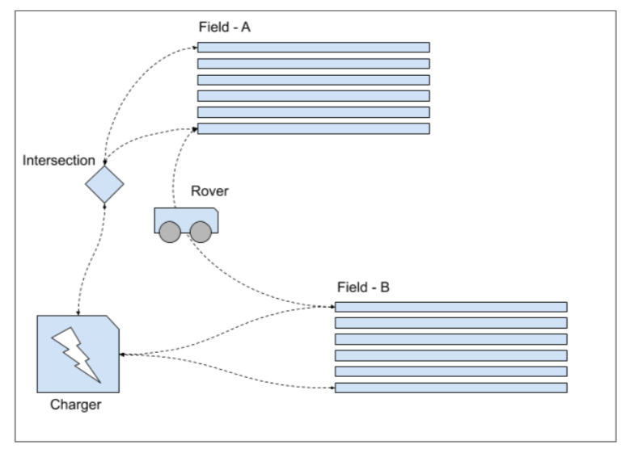

[](https://opensource.org/licenses/MIT)
[](https://bettercodehub.com/)

# A Python based simple navigation algorithm for a mobile robotic rover in a hydroponic lab

The Farmer in this project is a fictional point robot that is characterized as a mobile agent which can move between target
locations based on path waypoints. The paths and target locations are predefined in a `.json` file available in the `maps`
directory in this project. The robot can handle various tasks ranging from :
- going to a charging station for recharging the batteries; and
- going to a commanded row location in a cropland (a.k.a field in this project);

The user can also ask the robot to plant a specific crop in a specific row of a field through the commandline. The robot goes
to every target location by the shortest path using a euclidean distance based heuristic. The robot's navigation is characterized as one step for every second. The picture below shows an imaginary view of the whole setup. The dotted lines represent various paths connecting different locations of the farm with other locations (farm fields, charging station, etc.).



## About the Author

Arun Kumar Devarajulu is a Robotics graduate from University of Maryland, College Park. He has a wide range of interests in
Robotics and Computer Vision, ranging from development of path planning algorithms, robotic simulation, deep learning,
software development using agile practices, etc.

## License

This project is release under the MIT License

## Project running instructions

On your Linux/ Mac or Windows machine run the following commands in a terminal or command prompt :
```
git clone https://github.com/arunumd/Mobile_farm_robot_simulation.git
cd Rover
python3 Launcher.py
```

Later, please follow the on screen instructions for giving the commanded positions/ tasks to the farmer.

## Commanded positions and/ or tasks for the farmer

The farmer can perform two classes of tasks based on the user input. The classes are broadly classified as :
- go to tasks; and
- plant a crop 'ABC' task

The tasks are not space and case sensitive. For example the following are all acceptable formats :
```
gotofieldArow3
go TO Field A row 3
goto fieldA row3
```

or

```
goTo charger
gotO CharGER
gotoCharger
```

or

```
plantPoTaToESIn FielDB rOW14
plantCABBAgE inField A row 5
     plant RADDISH in fieldA row15
```
